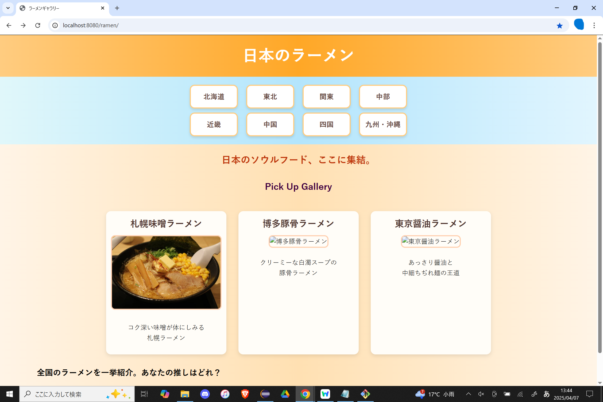
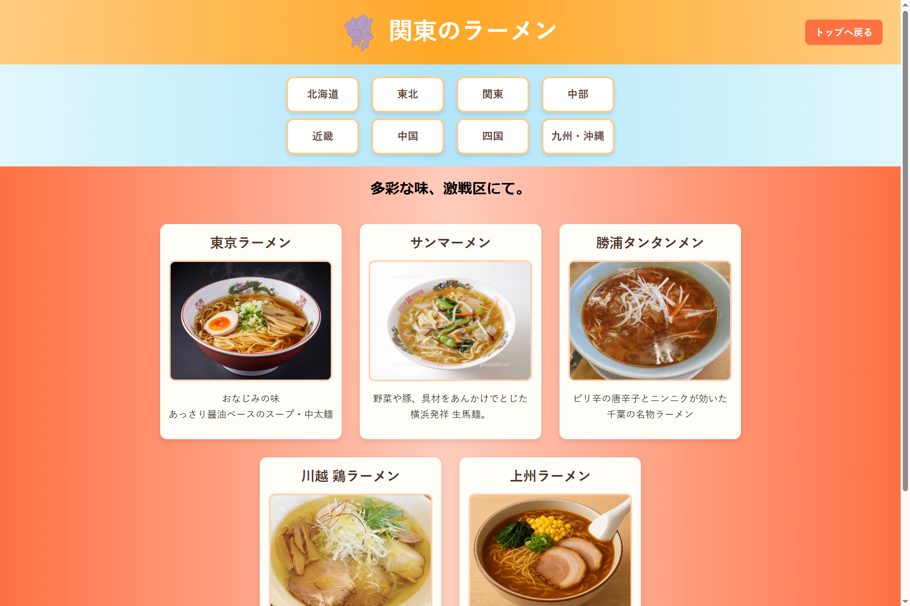

☆ramen ギャラリー
ポートフォリオ（Spring Boot + PostgreSQL）

これは Spring Boot を使って開発した、日本の地方ごとのラーメンギャラリーを表示するWebアプリです。  
ナビバーで画面遷移し、ギャラリーで写真やスクロールメッセージなどを楽しめます。

--

・ 使用技術

- Java（Spring Boot）
- HTML / CSS / JavaScript
- PostgreSQL（DB接続あり）

--

・ 画面イメージ

  

--

・ 起動方法（ローカル実行）

このプロジェクトは Eclipse（Spring Tools Suite または Pleiades）環境での実行を前提としています。  
以下の手順に従ってローカル環境でアプリを起動してください。

--

・セットアップ手順（ローカル環境）

  1. 必要な環境

- Java 17 以上
- Eclipse（Spring Tools Suite または Pleiades）
- PostgreSQL（ver 13 以上推奨）
- pgAdmin または psql（PostgreSQL管理ツール）
- Git Bash

--

2. GitHubからクローン

Git Bash を開き、任意のディレクトリで以下を実行：

git clone https://github.com/your-username/ramen.git
cd ramen

__

3. Eclipseでプロジェクトを読み込む

Eclipseを起動し、「ファイル」→「インポート」→「既存の Maven プロジェクト」を選択し、ramen フォルダを指定する。プロジェクトが読み込まれたらビルドが完了するまで待つ。

__



4. PostgreSQLを準備する。
  
  pgAdmin または psql を使用する。



4-1. ターミナル（Git Bashなど）で psql に接続する。

psql -U postgres

4-2. データベースを作成する。

CREATE DATABASE ramen_db;

4-3. 作成したデータベースに接続する。

\c ramen_db;

4-4. テーブル area_list を作成する。

CREATE TABLE area_list (
id SERIAL PRIMARY KEY,
area_name VARCHAR(100),
image_path VARCHAR(255),
description TEXT
);

4-5. サンプルデータを挿入する（任意）。

INSERT INTO area_list (area_name, image_path, description) VALUES
(‘北海道’, ‘/images/hokkaido.png’, ‘札幌味噌ラーメンが有名’),
(‘東北’, ‘/images/tohoku.png’, ‘喜多方ラーメンなどが有名’);

__

5. application.properties を編集する。

src/main/resources/application.properties に以下の内容を貼り付ける。


spring.application.name=ramen

server.port=8080

server.servlet.context-path=/ramen

spring.datasource.url=jdbc:postgresql://localhost:5432/ramen_db

spring.datasource.username=postgres

spring.datasource.password=systemttt

spring.datasource.driver-class-name=org.postgresql.Driver

spring.jpa.hibernate.ddl-auto=update

spring.jpa.database-platform=org.hibernate.dialect.PostgreSQLDialect

logging.level.org.hibernate.SQL=debug

spring.jpa.properties.hibernate.format_sql=true

spring.jpa.open-in-view=false

__
6. アプリケーションを実行する。

6-1. Eclipseから起動する場合

src/main/java/com/example/ramen/RamenApplication.java を右クリックして「Spring Boot アプリケーションとして実行」を選択する。

6-2. ターミナルから起動する場合（プロジェクトルートで）

./mvnw spring-boot:run
 ※ Windowsの場合は mvn spring-boot:run でも可
__

7. ブラウザで 表示http://localhost:8080/ramen/ にアクセスし、トップページが表示されることを確認する。



__
☆画面遷移無し、画面表示のみのサンプル

・ホーム画面

https://st182025.github.io/s-portfolio2025-04/html/home.html

・北海道

https://st182025.github.io/s-portfolio2025-04/html/hokkaido.html

・東北

https://st182025.github.io/s-portfolio2025-04/html/tohoku.html

・中部

https://st182025.github.io/s-portfolio2025-04/html/chubu.html

